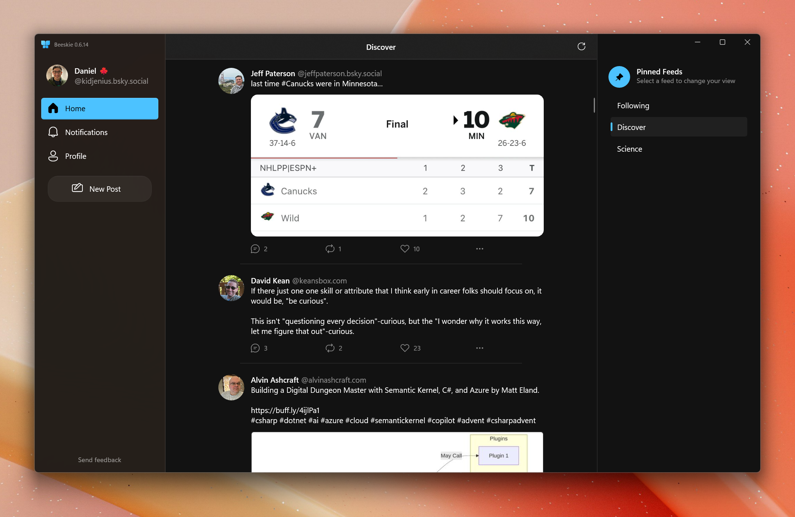

<p align="center">
  
</p>
<h1 align="center">
  Beeskie
</h1>
<p align="center">
  A Windows app for Bluesky
</p>
<p align="center">
  <a href="https://apps.microsoft.com/store/detail/9PCGNR7QHQGP?cid=github" target="_blank">
    
  </a>
</p>

## Introduction

Beeskie is a free and open source third-party app for Bluesky. Big kudos to the team that built the Bluesky APIs, which Beeskie relies on heavily. The APIs are extremely thorough and they're very friendly to third-party apps. 



## Current status: Beta

The app is currently in public beta. You can write new posts, reply, repost, and like. You can view some notifications and you can see some embedded images. While it's still in very early days, app development is moving very fast and new features are added on a daily basis. 

## Build from source

Pre-requisites
- Visual Studio 2022: https://apps.microsoft.com/detail/xpdcfjdklzjlp8
- XAML Styler extension (Install after VS 2022): https://marketplace.visualstudio.com/items?itemName=TeamXavalon.XAMLStyler2022

Instructions
- Clone this repo
- Open the `BlueskyClient.sln` file. This should open VS 2022.
- VS will mention that you are missing some workloads. Follow its instructions to install the suggested workloads.
- After installing, restart the solution
- The projects should load correctly.
- Right click on the `BlueskyClient.Uwp (Universal Windows)` project and select `Set as Startup Project`
- At the top of VS 2022, ensure the Architecture is set to `x64` instead of `Any CPU`
- Press F5, and Beeskie should run with the debugger.

If you run into problems, please file an issue!

## How can I help?

### Improving translations

Beeskie supports a few languages today, but translation is never an exact science. It's likely that the translations have grammar issues or there are contextual issues. To improve a translation, head to the MultilingualResources directory here: https://github.com/jenius-apps/beeskie/tree/main/src/BlueskyClient.Uwp/MultilingualResources. Then open one of the existing languages to edit it the text inside the `<target>` tages, then submit a pull request with your improvements. 

So for example, you might see something like this in one of the XLF files:

```
<trans-unit id="CancelText" translate="yes" xml:space="preserve">
  <source>Cancel</source>
  <target state="translated">キャンセル</target>
</trans-unit>
```

The text you'll want to modify is the text in between the `<target>` and `</target>` tags.

### Joining the Internal Beta

The internal beta receives updates faster than the public beta, and so the updates can be more unstable. Your feedback here will shape Beeskie's development and help ensure no major issues exist by the time an update is deployed to the public. 

To join the Internal Beta, fill out this form: https://forms.office.com/r/67VLxhxaNt. You'll receive an email confirming that you've been added.

### Helping test the Public Beta

Download the app from the store by clicking the badge above, follow [Beeskie on Bluesky](https://bsky.app/profile/beeskieapp.bsky.social), and send feedback to that handle! While I know there are many things missing still, it will be valuable if you tell me 3 things that you absolutely need ASAP in order to use the app on a more consistent basis. This will help me prioritize the features. Of course, you can let me know of other issues such as bugs. Lastly, you can also create an issue in this repo to submit any feedback. Thanks for your help!